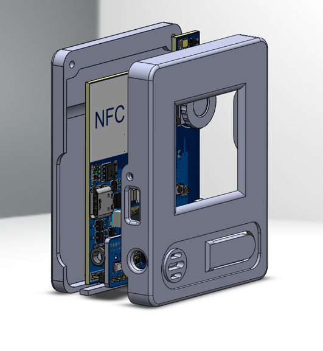
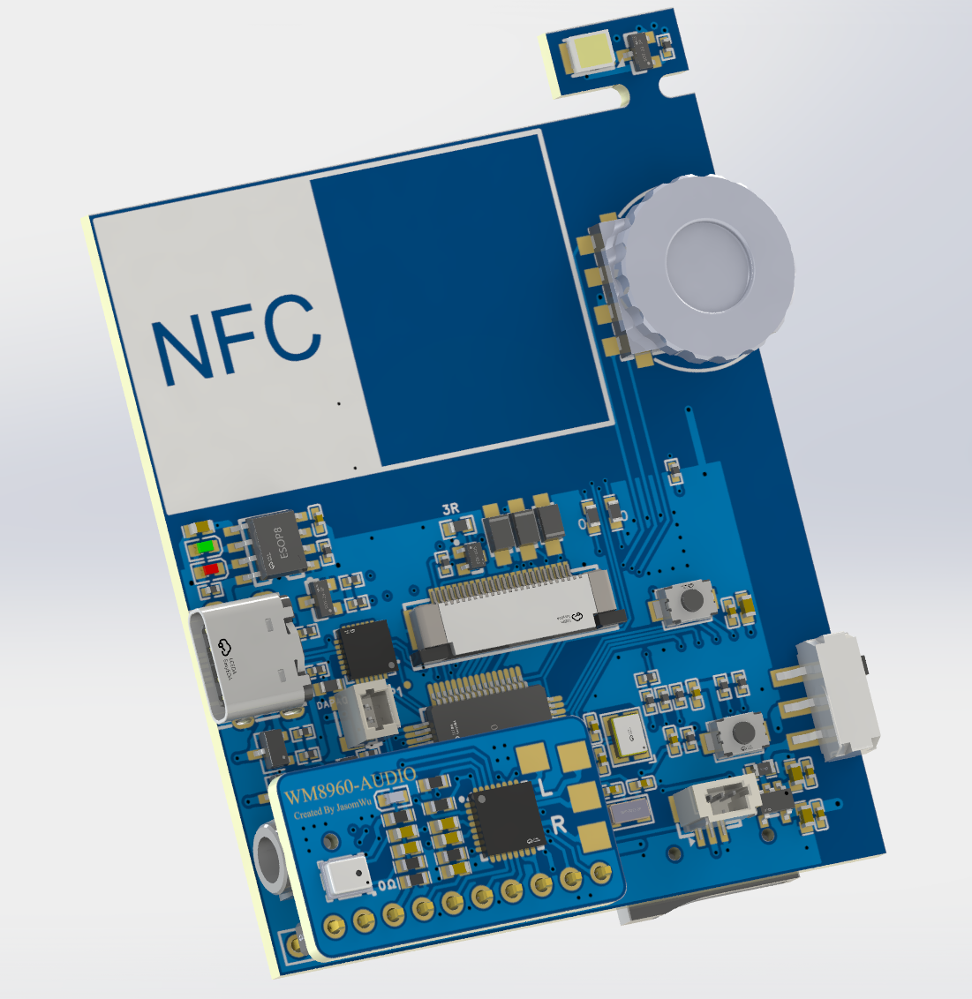
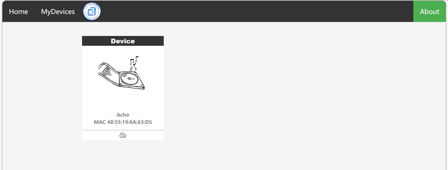

# 基于Django的微型物联网平台及多媒体联网终端设计

   
   
    

   

**文件说明**：  

+ Acho：基于STM32与ESP8266的多媒体终端  
  > 支持音频、图像等的网络传输    
  > 支持录音与音乐播放  
  > 1.44inch墨水屏  
  > FreeRTOS操作系统  
  > lvgl图形库  
  > 带按键的滚轮控制（美上美的编码按键）
+ IOTserver：Django框架的服务器  
  > 物联网平台系统界面  
  > 用户-设备通过二维码绑定  
  > 负责消息转发和用户、设备数据库信息表的维护  
  > websocket传输大文件及流媒体  
  > 图像预处理及压缩传输  
  > 提供语音识别接口，以及设备媒体文件上传、下载接口  
  > token登录状态维护  
+ IOTapp：安卓移动端物联网应用  
  > 二维码扫描进行设备绑定  
  > 设备状态检测  
  > 拍照/相簿上传图像  
  > 内嵌dither图像预处理算法  
  > 用户登录与注册  
+ ImgTransfer：基于C++的图像处理脚本  
  > 对图片进行灰度抖动处理  
  > 压缩图像并以lvgl图像格式输出.bin文件  
  
